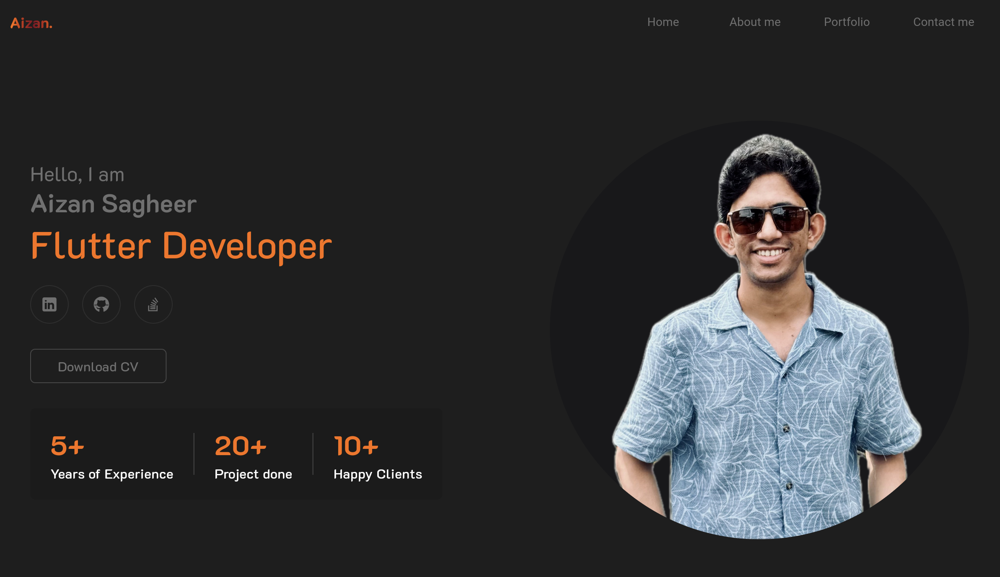
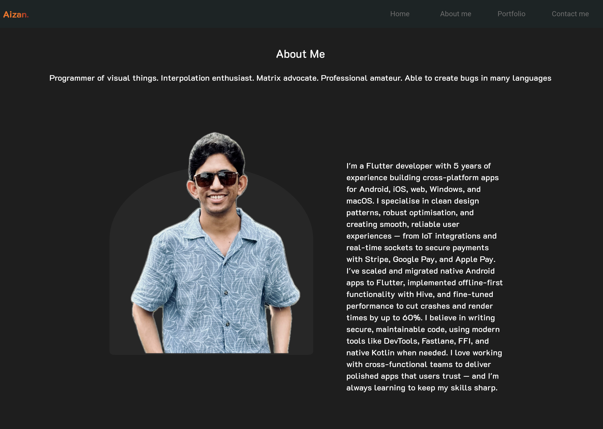
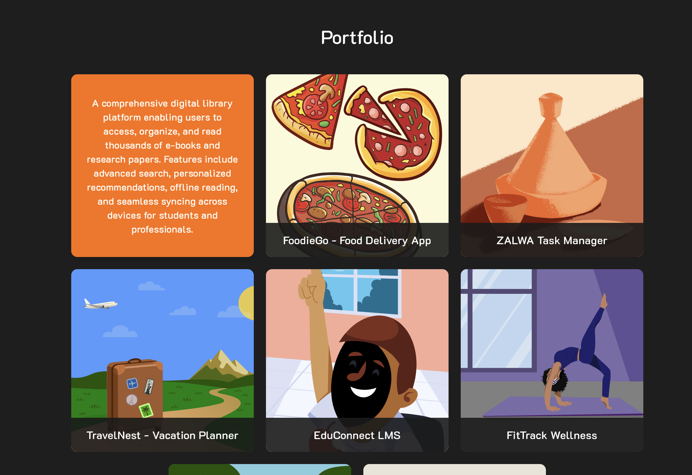
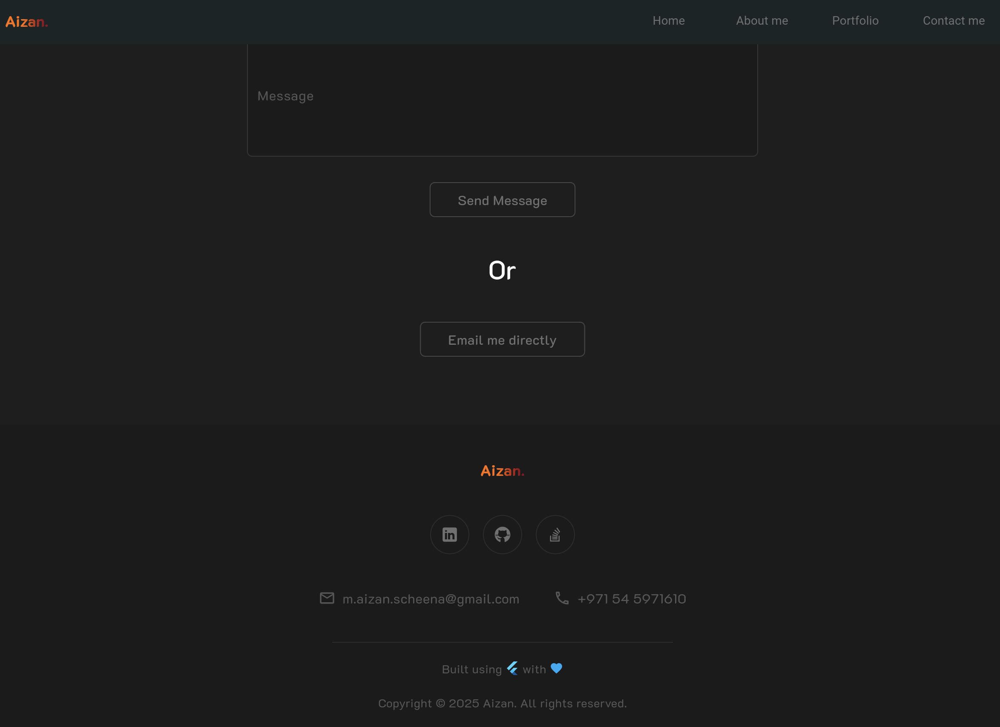
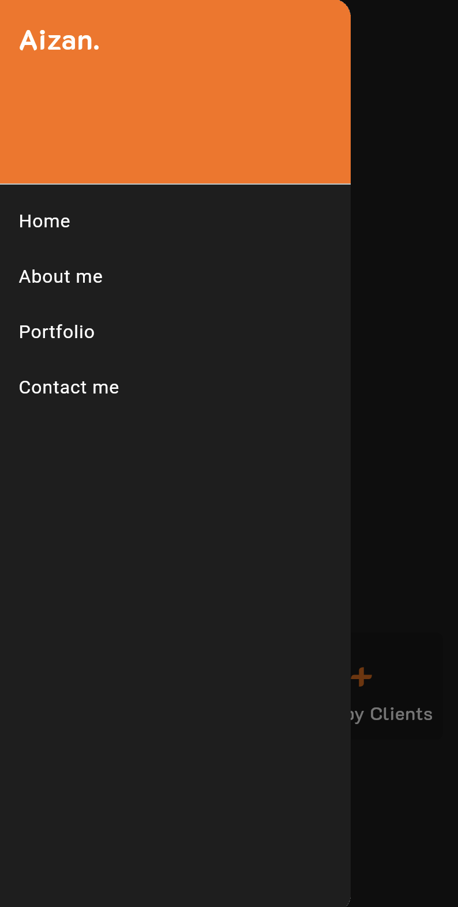
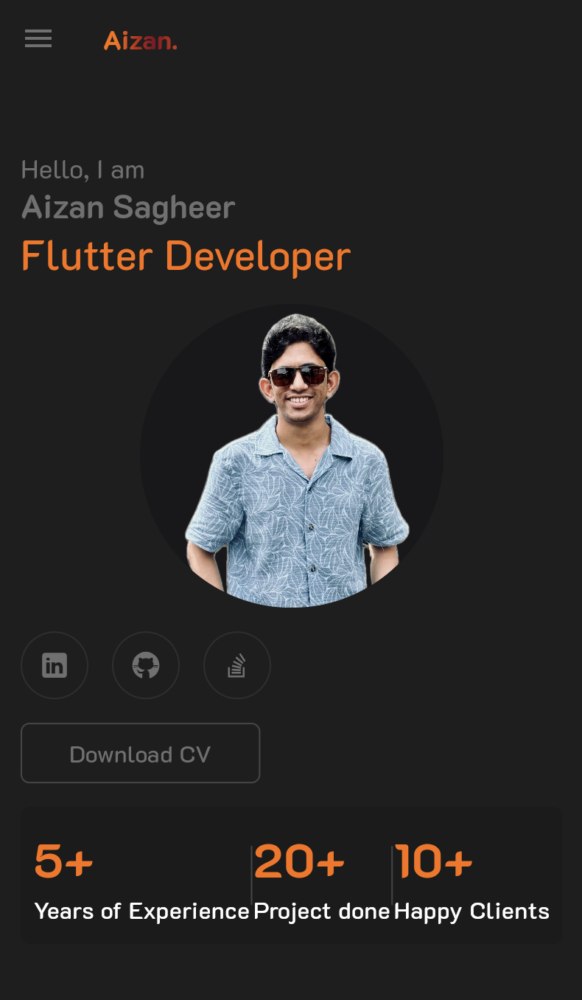

# aizan_folio

[](https://github.com/AizanSagheer/aizan_folio)

**Repository:** [https://github.com/AizanSagheer/aizan_folio.git](https://github.com/AizanSagheer/aizan_folio.git)

A professional cross-platform portfolio app built with Flutter, showcasing the skills, projects, and contact information of Aizan Sagheer (Flutter Developer).

## Features

- **Responsive Dashboard**: Adapts seamlessly to desktop and mobile layouts.
- **About Me Section**: Personal introduction and professional summary.
- **Skills Showcase**: Visual representation of technical skills (Flutter, Dart, Firebase, CI/CD, Testing, etc.).
- **Portfolio Projects**: Gallery of major projects with descriptions (e.g., Solar Digital Library, FoodieGo, ZALWA Task Manager, TravelNest, EduConnect LMS, FitTrack Wellness, GreenThumb, SafePay Wallet).
- **Contact Form**: Users can send messages directly from the app.
- **Download CV**: Download the developer's resume as a PDF.
- **Social Links**: Quick access to LinkedIn, GitHub, and Stack Overflow profiles.
- **Modern UI**: Clean, visually appealing design using custom themes and Google Fonts.

## Screenshots

### Dashboard (Desktop)


### About Me Section (Desktop)


### Portfolio Section (Desktop)


### Footer (Desktop)


### Drawer (Mobile)


### Dashboard (Mobile)


## Getting Started

### Prerequisites
- [Flutter SDK](https://flutter.dev/docs/get-started/install) (>=3.6.0)
- Dart SDK (comes with Flutter)

### Installation
1. **Clone the repository:**
   ```bash
   git clone <repo-url>
   cd aizan_folio
   ```
2. **Install dependencies:**
   ```bash
   flutter pub get
   ```
3. **Run the app:**
   ```bash
   flutter run
   ```
   You can run on Android, iOS, web, Windows, or macOS.

### Web Support
To run on the web:
```bash
flutter run -d chrome
```

> **Note:** This app has been tested on Desktop web only.

## Project Structure

- `lib/`
  - `controllers/` – Business logic (skills, projects, CV download)
  - `models/` – Data models for skills, projects, contact form
  - `utils/` – App-wide constants (colors, images)
  - `views/` – UI screens and widgets (dashboard, sections, widgets)
- `assets/` – Images, icons, and resume PDF
- `test/` – Widget and unit tests

## Customization
- Update `assets/Aizan Sagheer Flutter developer resume.pdf` to change the downloadable CV.
- Add or modify skills and projects in `lib/controllers/dashboard_controller.dart`.
- Update social links in the relevant widgets in `lib/views/widgets/`.

## Dependencies
- [flutter_svg](https://pub.dev/packages/flutter_svg)
- [google_fonts](https://pub.dev/packages/google_fonts)
- [http](https://pub.dev/packages/http)
- [url_launcher](https://pub.dev/packages/url_launcher)
- [universal_html](https://pub.dev/packages/universal_html)
- [visibility_detector](https://pub.dev/packages/visibility_detector)

## Credits
- Developed by Aizan Sagheer
- [LinkedIn](https://www.linkedin.com/in/aizan-sagheer-46074b11a/)
- [GitHub](https://github.com/AizanSagheer)
- [Stack Overflow](https://stackoverflow.com/users/15968808/aizan-sagheer)

## License
This project is for personal portfolio use. Contact the author for other uses.
